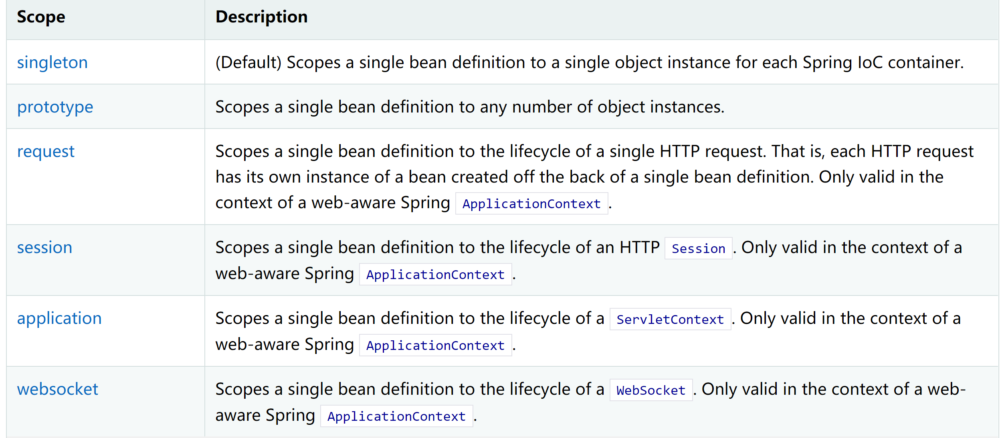
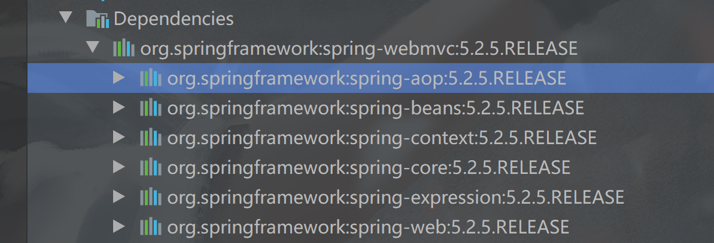
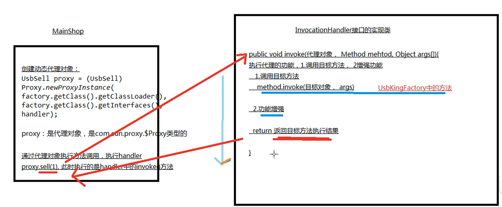

# Spring

Spring理念：使得现有的技术更加的实用，本身就是一个大杂烩，整合现有的框架技术

优点：

- Spring是一个免费的开源的框架，容器
- 轻量级框架，非入侵式的
- 控制反转IOC，面向切面AOP

总而言之，就是一个轻量级的控制反转IOC和面向切面编程AOP的容器

#### 1、 IOC（控制反转）理论

```java
public void setUserDao(UserDao userDao) {
    this.userDao = userDao;
}
```

举例说明：在之前程序都是主动创建对象，控制权在程序员手上，使用set注入之后程序不再具有主动性，而是被动的接受对象，这种思想从本质上解决了问题，程序员不用去管理对象的创建，更多的关注业务的实现

就是一种设计思想，DI是IOC的一种实现方式，在没有IOC的程序中，对象的创建与对象之间的依赖关系完全编码在程序中，对象的创建完全由程序自己控制，控制反转后，对象的创建转移给第三方，由第三方去管理对象

**控制反转是一种通过描述（xml或者注解）并通过第三方去生产获取特定对象的方式。在spring中实现控制反转的是IOC容器，其实现方法是依赖注入**  


耦合：程序间的依赖关系（类之间的依赖，方法之间的依赖）

解耦：降低程序间的依赖关系

实际的开发中应该做到编译时不依赖，运行时才依赖，这种才可以解决程序独立性很差的问题

解耦的思路：（JDBC注册时forName）

1、使用反射来创建对象，而避免使用new关键字

2、通过读取配置文件来获取要创建的对象的全类限定名

**概念**：将创建对象的权利交给框架，包括**依赖注入（DI）**和**依赖查找**

**作用**：降低程序间的耦合（依赖关系）

- DI：依赖关系的维护，可以注入的数据有三类：基本类型和String；其他的bean类型；复杂类型/集合类型；

  ​		注入的方式有三种：使用构造函数提供；使用set方法提供；使用注解提供


####   2、IOC创建对象的方式

##### 2.1 使用无参构造创建对象，默认

```xml
 <bean id="hello" class="nancy.pojo.Hello" >
        <!--属性注入-->
        <property name="str" value="Spring"/>
 </bean>
```


##### 2.2使用有参构造创建对象

- 下标赋值

  ```xml
   <bean id="hello2" class="nancy.pojo.Hello">
          <!--使用下标进行赋值-->
          <constructor-arg index="0" value="nancy"/>
   </bean>
  ```

  

- 利用类型进行创建（不推荐使用）----存在相同的类型

  ```xml
  <bean id = "hello3" class="nancy.pojo.Hello">
          <!--利用类型进行注  注意:基本数据类型使用int 引用类型使用全包名 -->
          <constructor-arg type="java.lang.String" value="nancy"/>
  </bean>
  ```

  

- 利用参数名进行赋值

  ```xml
   <!-- 使用参数名进行注入-->
  <bean id = "hello4" class="nancy.pojo.Hello">
      <constructor-arg name="s" value="nancy"/>
  </bean>
  ```


总结：在配置文件加载的时候，容器中管理的对象就已经初始化了，并且只有一份实例

#### 3、Spring配置

##### 3.1别名(Alias)

```xml
<!--别名-->
<alias name="user" alias="userNew"/>
```

#####  3.2 bean的配置

```xml
<!--通过name属性也可以创建别名，而且可以取别名-->
    <bean id="user" class="nancy.dao.User" name="userNew2，userNew3">
        <!--通过参数名进行设置 -->
<!--        <property name="name" value="nancy"/>-->
        <!--通过下标进行创建对象-->
<!--        <constructor-arg index="0" value="nancy2"/>-->
        <!--通过类型创建对象-->
<!--        <constructor-arg type="java.lang.String" value="nancy3"/>-->
    </bean>
```

##### 3.3 import

一般用于团队开发，可以将多个配置文件，导入合并为一个文件中

#### 4、依赖注入（DI）

依赖：bean中的对象的创建依赖于对象

注入：对象中的属性由容器进行注入

##### 4.1 构造器注入

##### 4.2 set方法注入

```xml
<bean id="student" class="nancy.dao.Student">
    <!--第一种，普通值注入，value-->
    <property name="name" value="nancy"/>
    <!--第二种Bean注入，ref-->
    <property name="address" ref="address"/>
    <!--数组注入-->
    <property name="books">
        <array>
            <value>南瓜</value>
            <value>西瓜</value>
            <value>冬瓜</value>
        </array>
    </property>
    <!--list-->
    <property name="hobbys">
        <list>
            <value>唱歌</value>
            <value>吃饭</value>
        </list>
    </property>

    <!--Map-->
    <property name="card">
        <map>
            <entry key="nancy" value="111"/>
            <entry key="wendy" value="222"/>
        </map>
    </property>
    <!--set-->
    <property name="games">
        <set>
            <value>lol</value>
        </set>
    </property>

    <!--null-->
    <property name="wife">
        <null></null>
    </property>

    <!--properties-->
    <property name="info">
        <props>
            <prop key="学号">2018</prop>
            <prop key="性别">女</prop>
        </props>
    </property>
</bean>
```

##### 4.3 拓展方式注入

使用c和p命名空间进行属性注入

```xml
<!--p命名空间注入，可以直接注入属性的值：property-->
<bean id="user" class="nancy.dao.User" p:name="nancy"/>
<!--使用c命名空间通过构造器进行注入-->
<bean id="user2" class="nancy.dao.User" c:name="nancy2"/>
```

注意：p和c不能同时使用，需要导入xml约束

```xml
xmlns:p="http://www.springframework.org/schema/p"
xmlns:c="http://www.springframework.org/schema/c"
```

##### 4.4 bean的作用域



1. 单例模式（Spring默认机制）

   ```xml
   <bean id="user1" class="nancy.dao.User" c:name="nancy2" scope="singleton"/>
   ```

2. 原型模式：每次从容器中get的时候都会产生新对象

#### 5、Bean的自动装配

自动装配是Spring的满足bean依赖的一种方式

Spring会在上下文中自动寻找，并且给bean装配属性

spring中存在三种装配的方式：1、在xml中显示装配2、在java中显示装配3、隐式的装配bean

##### 5.1 byname自动装配

注意：需要确保所有bean的id唯一，并且这个bean需要和自动注入的属性set方法的值一致

```xml
<!--byname:会自动在容器上下文中查找和自己set方法后名字相同的id-->
<bean id="people" class="nancy.dao.People" autowire="byName">
    <property name="name" value="nancy"/>

</bean>
```

##### 5.2 byType自动装配

注意：需要确保所有bean的class唯一，并且这个bean需要和自动注入的属性的类型一致

```xml
<!--byType:会自动在容器中查找和自己对象属性相同的bean-->
<bean id="people" class="nancy.dao.People" autowire="byType">
    <property name="name" value="nancy"/>
</bean>

```

##### 5.3 注解实现装配

1. 导入约束：context约束

   ```xml
   <?xml version="1.0" encoding="UTF-8"?>
   <beans xmlns="http://www.springframework.org/schema/beans"
          xmlns:xsi="http://www.w3.org/2001/XMLSchema-instance"
          xmlns:context="http://www.springframework.org/schema/context"
          xsi:schemaLocation="http://www.springframework.org/schema/beans
           https://www.springframework.org/schema/beans/spring-beans.xsd
           http://www.springframework.org/schema/context
           https://www.springframework.org/schema/context/spring-context.xsd">
   
       <context:annotation-config/>
       <bean id="cat1" class="nancy.dao.Cat"/>
   
   
       <bean id="dog1" class="nancy.dao.Dog"/>
   
   
       <bean id = "people" class="nancy.dao.People"/>
   
   </beans>
   ```

   

2. 配置注解的支持

**@Autowired**

直接在属性上使用即可！也可以在set方法上使用，使用autowired我们可以不用编写set方法，但是前提是你这个自动装配的属性在IOC容器中存在，并且符合名字


*如果显示定义了Autowired的required属性为false，说明这个对象可以为null，否则不允许为空*；直接使用Nullable，倘若字段标记了这个注解，说明这个注解可以为null


如果@Autowired自动装配的环境比较复杂，自动装配无法通过一个注解完成的时候，我们可以使用@Qualifier

(value="XXX")去配合使用，指定唯一的bean对象注入

```java
@Autowired
@Qualifier(value="dog111")
private Dog dog;
```


**@Resource注解**

```java
@Resource(name="cat2")
private Cat cat;

@Resource
private Dog dog;
private String name;
```

<font color="red">区别</font>:

- 都是用来自动装配的，都可以放在属性字段上
- @Autowired 通过 byType实现，而且要求对象存在，如果type不唯一则配合Qualifier进行使用
- @Resource 通过 byName 实现，如果找不到名字，则通过byType实现，如果都找不到则报错

#### 6、使用注解

在spring4之后，要使用注解要确保aop这个包的存在



使用注解要导入context约束

```xml
<?xml version="1.0" encoding="UTF-8"?>
<beans xmlns="http://www.springframework.org/schema/beans"
       xmlns:xsi="http://www.w3.org/2001/XMLSchema-instance"
       xmlns:context="http://www.springframework.org/schema/context"
       xsi:schemaLocation="http://www.springframework.org/schema/beans
        https://www.springframework.org/schema/beans/spring-beans.xsd
        http://www.springframework.org/schema/context
        https://www.springframework.org/schema/context/spring-context.xsd">

    <context:annotation-config/>
</beans>
```


1. bean

2. 属性注入

   ```java
   //组件放在类上，说明这个类被spring管理了，就是bean
   @Component
   public class User {
       @Value("nanxi")
       public String name ;
   }
   ```

   

3. 衍生注解

   Component存在几个衍生注解，在开发中，会按照mvc三层架构进行分层

   - dao (@Repository) 

   - service (@Service)

   - controller(@Controller)

     功能一样，都是代表将类装配到spring容器中

4. 作用域

   ```java
   @Component
   @Scope("prototype")
   public class User {
   
       @Value("nanxi")
       public String name ;
   
   }
   ```

5. 小结

   注解与 xml：

   - xml 更加万能，适用于各种场合，维护简单方便
   - 注解  不是自己的类使用不了，维护相对复杂

   最佳组合：

   - xml 用来管理bean
   - 注解 用来进行属性的注入

   #### 7、使用Java的方式配置spring
   
   spring的新java配置支持的主要工件是带 `@Configuration`注释的类和-带`@Bean`注释的方法，@Bean这个注解被用于指示一个方法的实例，可以配置，并且初始化到由ioc管理的容器中`@Bean`注释的作用与`<bean/>`元素相同，`@Configuration`表明其主要目的是作为Bean定义的来源
   
   ```java
   @Configuration//代表这是一个配置类，就是我们之前看到的beans.xml，这个也会spring托管，注册到容器中，因为他本来就是一个component
   public class Configt {
   
       //注册一个bean，就相当于在配置文件中写的一个bean标签，
       //这个方法的名字就相当于bean标签中的id属性
       //这个方法的返回值就相当于bean标签中的class属性
       @Bean
       public User getUser(){
           return new User();//返回注入到bean的对象
       }
   
   }
   ```

#### 7、代理模式

是SpringAOP的底层

代理模式：静态代理和动态代理

##### 7.1 静态代理

角色分析：

- 抽象角色：一般使用接口或者抽象类决定
- 真实角色：被代理的角色
- 代理角色：代理真实角色
- 客户：访问代理角色的

代理模式有优点：

- 可以使真实角色的操作更加的纯粹，不用去关注一些公共业务
- 公共的业务就交给代理角色，实现了业务的分工
- 公共业务发生扩展的时候，方便集中管理

缺点：

- 一个真实的角色会产生一个代理类，代码量会翻倍，开发效率比较低

##### 7.2 动态代理

在程序的执行过程中，使用jdk的反射机制，创建对象的能力，创建代理类的对象，不用你创建类文件，并动态的指定要代理的目标类

动态：在程序执行时，调用jdk提供的方法才能创建代理类的对象

**作用**：

1. 控制访问，在代理中，控制是否可以直接调用目标对象的方法
2. 功能增强，可以在完成目标对象调用时，附加一些额外的功能

- 基于接口---JDK动态代理：使用java反射包中的类和接口实现动代理的功能，里面有三个类，InvocationHandler、Method、Proxy
- 基于类----cglib:使用第三方工具库，创建代理对象，原理是继承，通过继承目标类，创建他的子类，在子类中重写父类的方法，从而实现功能的修改
- java字节码实现----javasist

实现动态代理步骤：

- 创建接口，定义目标类要完成的功能
- 创建目标实现类
- 创建InvocationHandler接口的实现类，在invoke方法中完成代理类的功能
  - 调用目标方法
  - 增强功能
- 使用Proxy类的静态方法，创建代理对象，并将返回值转为接口类型

​    


#### AOP（面向切面编程）

是指通过**预编译的方式**和**运行期动态代理**实现程序功能的统一维护的一种技术，利用AOP可以对业务逻辑的各个部分进行隔离，从而使得业务各逻辑各部分之间的耦合度降低，提高程序的可重用性，提高了开发的效率

简单点说就是把我们程序中重复的代码拿出来，在需要执行的时候，使用动态代理的技术，在不修改源码的方式下，对我们已有的方法进行增强


## Spring MVC 

MVC三层架构：模型（Model)、视图（View)、控制器(Controller),是将业务、数据、显示分离的方法来组织代码。

- 模型（Model)：数据和行为。（dao，service）提供了模型数据查询和模型数据更新的等功能，包括数据和业务
- 视图（View)：进行吗模型展示，就是我们见到的用户界面
- 控制器(Controller)：接收用户的请求，委托给模型进行处理，处理完成之后，将返回的数据模型交给视图。

**职责**：

- 模型（Model）：业务逻辑、保存数据的状态（javaBean）
- 视图（View）：显示页面（JSP）
- 控制器（Controller)：拿到表单的数据、调用业务逻辑、转向指定的页面（Servlet）

Spring MVC 是Spring FrameWork的一部分，是基于Java实现MVC轻量级的Web框架，它通过一套注解，让一个简单的Java类称为成为处理请求的控制器，不需要实现任何接口，支持RestFul编码风格的请求

特点：轻量级，简单易学；高效，基于请求响应的MVC框架；与Spring兼容性好；简洁灵活；功能强大；约定优于配置


用户发起请求的时候，会经过前端控制器DispatcherServlet，DispatcherServlet会根据这个请求找到映射器，然后将映射器返回回来，根据这个映射器再去适配这个映射器（cotroller），由具体的controller去执行，会返回model和view，在根据modol和view去配置具体的视图解析器视图解析器返回给前端

**SpringMVC和Struct2的区别**

共同点：都是表现层框架，都是基于MVC模型编写的

​				底层都是利用ServletAPI

​				处理请求机制都是一个核心控制器

区别：SpringMVC的入口是Servlet，Struct2的是Filter

​            SpringMVC是基于方法设计的，Struct2是基于类设计的，Struct2的框架是多例的，每次发送一个请求，都会创造一个Struct2的框架，然后执行方法，处理请求；而MVC是单例的，只会创建一个实例，当接收一个请求的时候，调用方法进行处理  


## Spring Boot

可以说Spring boot框架是spring家族中一个全新的框架，简化了spring应用程序的创建和开发的过程，可以简化我们以前使用Spring MVC+Spring+MyBatis框架开发使用的搭建整合三大框架，我们需要配置web.xml,配置Spring,需要大量的进行配置，Spring Boot框架抛弃了繁琐的xml配置过程，采用默认的配置简化了我们的开发过程

特性：

1、可以快速创建基于Spring的应用程序

2、可以直接使用java main方法启动内嵌的Tomcat服务器运行Spring Boot程序，而不需要使用war

3、根据maven的依赖配置，Spring Boot自动配置Spring和Spring MVC

4、可以完全使用注解


